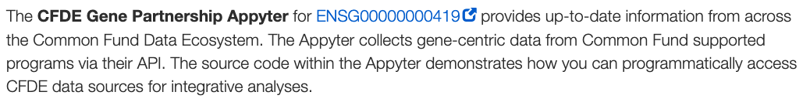

## Example: Appyter links for gene pages

This link and explanatory text is produced for each gene entry,
with only one gene-specific component - the HTTP GET argument for
`args.gene`.

It is produced by the script [build-appyter-gene-links.py](https://github.com/nih-cfde/update-content-registry/blob/main/scripts/build-appyter-gene-links.py) which adds a link to a pre-built Appyter to each 'gene' page.

This is probably the simplest example, and is a good one to start with!

## Example: Alias table for gene pages

This table (produced for each gene entry) translates the Ensembl IDs
used in the C2M2 into a variety of other gene accessions and
identifiers.

It is produced by the script [build-markdown-pieces-gene-translate.py](https://github.com/nih-cfde/update-content-registry/blob/main/scripts/build-markdown-pieces-gene-translate.py).

This is a good example of a script that uses auxiliary information -
here, a TSV file that maps Ensembl IDs to other identifiers - to produce
its annotations.

## Example: transcript list

## Example: gene expression widget

