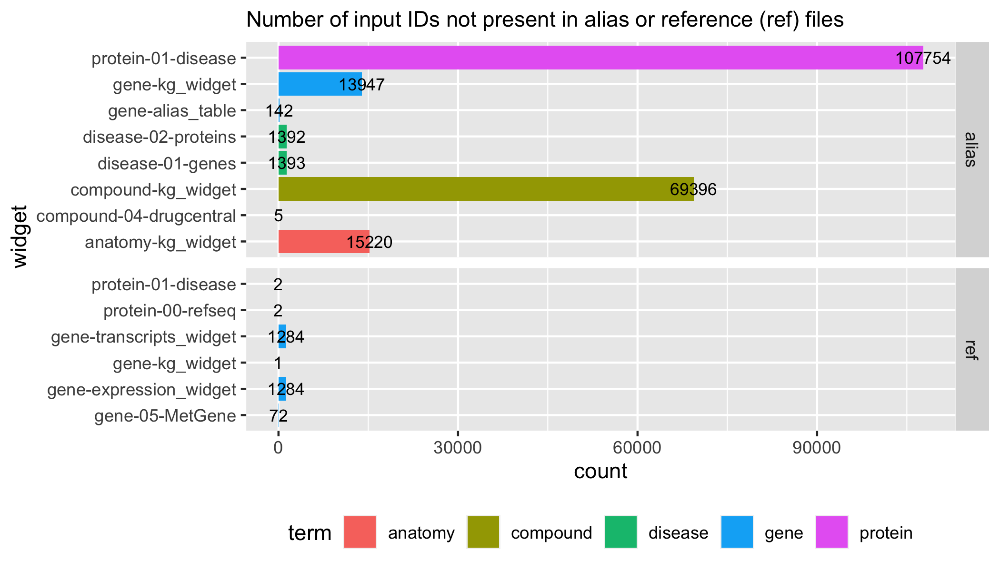

```{r setup, include=FALSE}
knitr::opts_chunk$set(echo = F, warning = F, message = F)
```

## README

Summary of IDs used to write new markdown content and those skipped because they were not in a reference or alias file. 

Last updated: `r Sys.time()`


```{r summary}
library(tidyverse)

df <- read_csv("chunks.csv", col_names = F) %>%
  rename(written = X2)

df2 <- read_csv("skipped.csv", col_names = F) %>%
  mutate(V1 = paste0("output_pieces_", X2, "/", X1)) %>%
  group_by(V1, X4) %>%
  summarise(skipped = n()) %>%
  ungroup() %>%
  rename(X1 = V1) %>%
  full_join(., df, by = "X1") %>%
  mutate(X1 = gsub("output_pieces_", "", X1)) %>%
  mutate(X1 =  gsub("/", " ", X1)) %>%
  separate(X1, into = c("term", "widget"), sep = " ") %>%
  select(term, widget, written, X4, skipped) %>%
  mutate_at(c(3,5), ~replace(., is.na(.), 0)) %>%
  pivot_wider(id_cols = term:written, names_from = "X4", values_from = "skipped") %>%
  select(term:ref) %>%
  rename(not_in_ref = ref,
         not_in_alias = alias) %>%
  mutate_at(c(4:5), ~replace(., is.na(.), 0)) %>%
  arrange(term, widget, written, not_in_alias, not_in_ref) %>%
  as.data.frame()

df2
```




